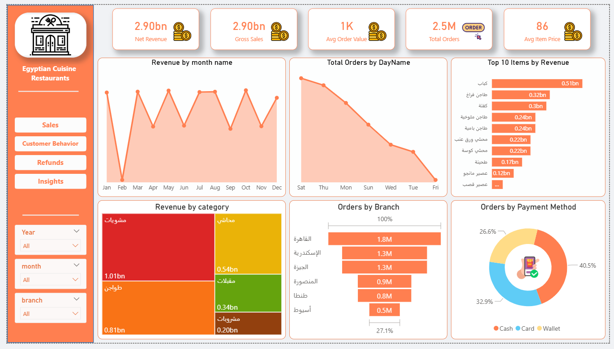
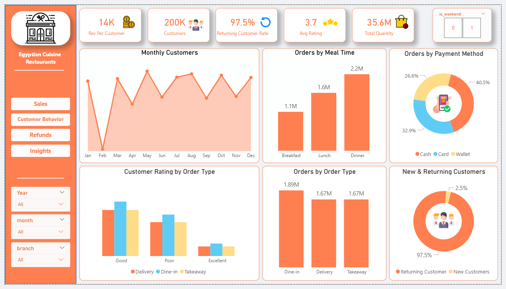
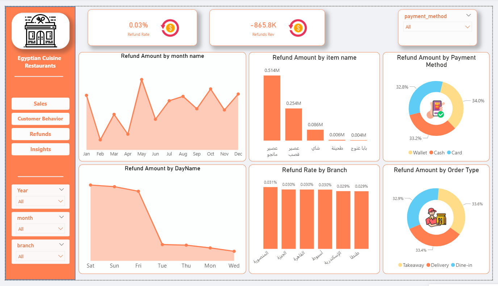
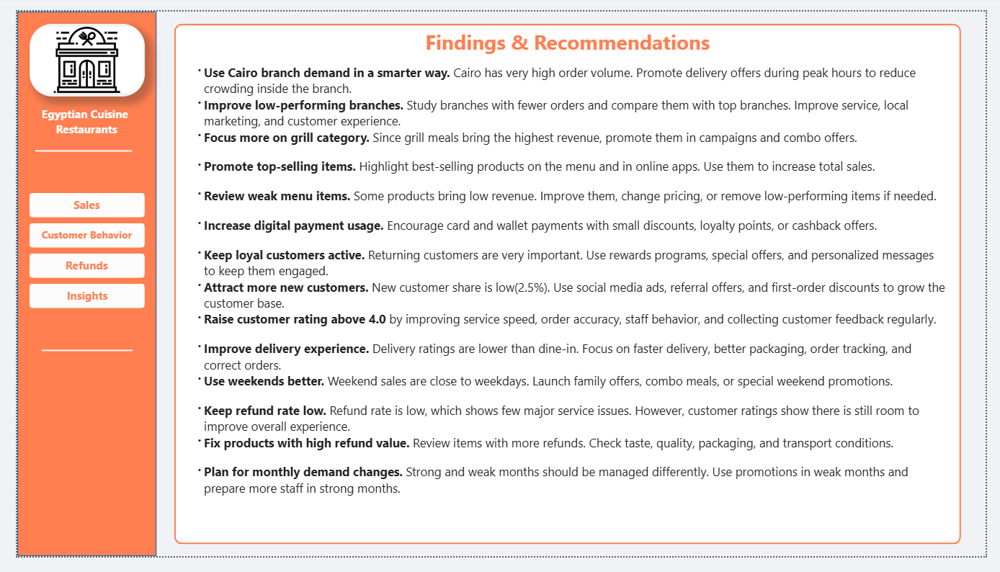
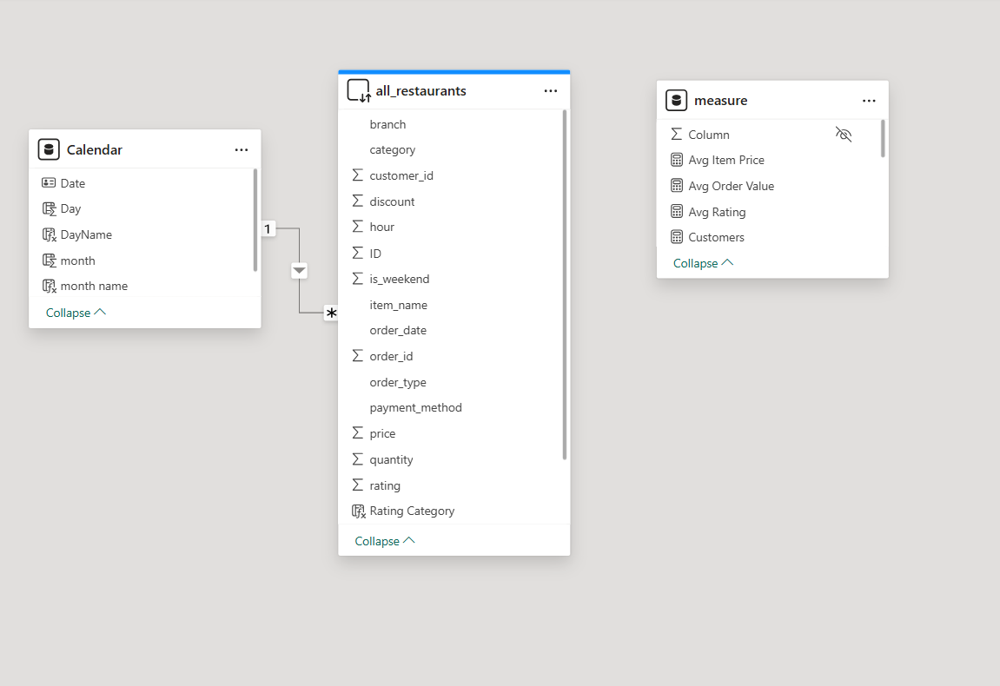

# Egyptian Cuisine Restaurants Analysis 

## Overview
This project analyzes restaurant performance for Egyptian cuisine restaurants using Power BI.

The dashboard focuses on:

- Sales 
- Customer Behavior
- Refunds 
- Business 

---

## Tools Used

- Power BI
- Dax
- Databricks
- SQL

---

## Main KPIs

- Net Revenue: 2.898bn
- Total Orders: 2.5M
- Avg Order Value: 1.2K
- Customers: 200K
- Returning Customers: 97.5%

---

## Dashboard Pages

### Sales Dashboard

### Customer Behavior

### Refund Dashboard

### Insights

### Data Model

---

## Key Insights

- Cairo branch has the highest number of orders.
- Returning customers represent 97.5%.
- Refund rate is very low (0.03%).
- Cash is the most used payment method.
- Some products generate higher revenue than others.

---

## Recommendations

- Improve low-performing branches.
- Increase digital payments.
- Promote top-selling products.
- Attract new customers.
- Improve delivery experience.

---

## Dataset

This project analyzes a large-scale dataset with 11,110,000 rows.

Databricks was used for handling, cleaning, and transforming big data efficiently.

A sample dataset is included in this repository for reference.
